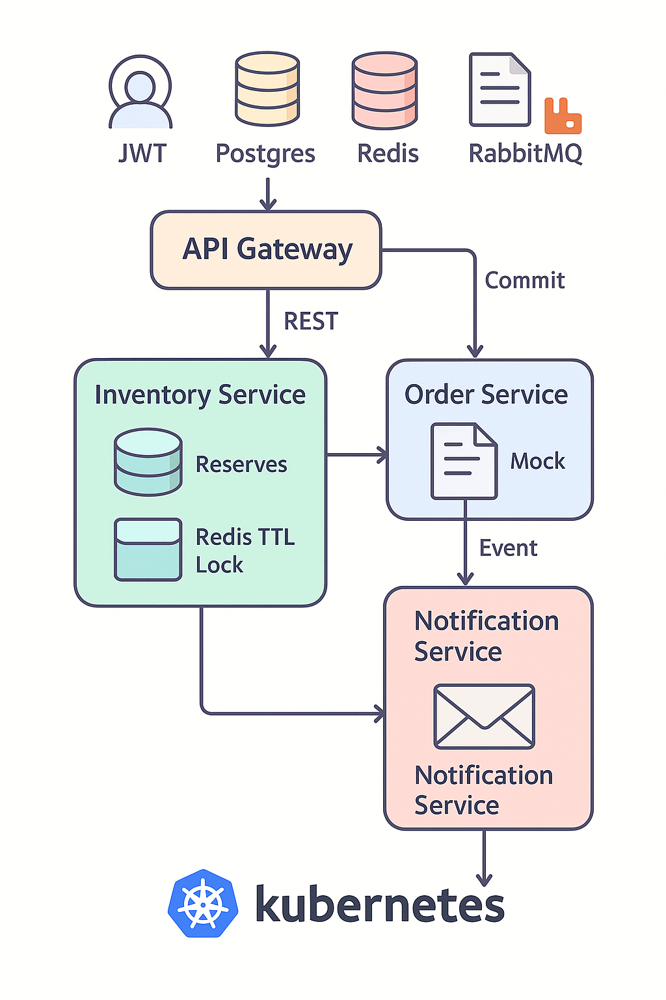

# 🎟️ E-Ticketing Pro - Professional Event Management

A **cloud-native event ticket booking platform** built with **microservices**.  
It demonstrates **scalability, high availability, security, async messaging, and modern deployment** with Kubernetes & Docker.

---

## ☁️ Cloud Architecture

<p align="center">
  
</p>

---

## 🚀 Quick Start

### 🐳 Local Development (Docker)

1️⃣ **Run services**

```bash
cp .env.example .env
docker compose -f deploy/compose/docker-compose.yaml up -d --build
```

2️⃣ **Run DB migrations & seed**

```bash
docker compose -f deploy/compose/docker-compose.yaml exec inventory npm run db:migrate
docker compose -f deploy/compose/docker-compose.yaml exec inventory npm run db:seed
```

3️⃣ **Test APIs**

```bash
curl -s http://localhost:8080/health
curl -s http://localhost:8080/api/v1/events
```

👉 RabbitMQ UI available at **http://localhost:15672** (`guest/guest`).

---

### ☸️ Kubernetes (Kind)

1️⃣ **Create cluster**
```bash
kind create cluster --name ruhu
kubectl cluster-info --context kind-ruhu
```

2️⃣ **Deploy base infrastructure**
```bash
kubectl apply -f deploy/k8s/base/00-namespace.yaml
kubectl -n eticketing apply -f deploy/k8s/base/10-postgres.yaml
kubectl -n eticketing apply -f deploy/k8s/base/11-redis.yaml
kubectl -n eticketing apply -f deploy/k8s/base/12-rabbitmq.yaml
kubectl -n eticketing apply -f deploy/k8s/base/20-services.yaml
```

3️⃣ **Add config & secrets**
```bash
kubectl -n eticketing create configmap app-config \
  --from-literal=JWT_SECRET=dev-secret \
  --from-literal=JWT_ISS=eticketing \
  --from-literal=JWT_AUD=eticketing-ui \
  --from-literal=POSTGRES_HOST=postgres \
  --from-literal=POSTGRES_DB=ruhu \
  --from-literal=POSTGRES_USER=postgres \
  --from-literal=REDIS_HOST=redis \
  --from-literal=REDIS_PORT=6379 \
  --from-literal=RABBITMQ_URL=amqp://rabbitmq:5672

kubectl -n eticketing create secret generic app-secrets \
  --from-literal=POSTGRES_PASSWORD=postgres
```

4️⃣ **Ingress setup**
```bash
kubectl apply -f deploy/k8s/base/ingress-nginx-kind.yaml
kubectl -n eticketing apply -f deploy/k8s/base/30-ingress.yaml
kubectl -n ingress-nginx port-forward svc/ingress-nginx 8080:80
```

Edit `/etc/hosts`:
```
127.0.0.1 eticketing.local
```

✅ **App UI** → [http://eticketing.local:8080/login.html](http://eticketing.local:8080/login.html)  
✅ **Health check**:
```bash
curl -i -H "Host: eticketing.local" http://127.0.0.1:8080/health
```

---

## 🧩 Microservices

- **api-gateway** → Edge routing, JWT auth, CORS, rate limiting  
- **inventory** → Events, ticket types, reservations (Redis lock + Postgres state)  
- **order** → Saga orchestration (reservations → commit → payment)  
- **payment** → Mock payment API (idempotent), webhook endpoint  
- **notification** → Consumes RabbitMQ events, simulates “email” delivery  

---

## 🛠️ Tech Stack

- **Runtime** → Node.js (Express + Zod)  
- **Datastores** → PostgreSQL, Redis  
- **Messaging** → RabbitMQ  
- **Infra** → Docker, Kubernetes (Kind), Ingress-Nginx  
- **Deployment** → ConfigMaps, Secrets, Horizontal Pod Autoscaler (HPA)  
- **Security** → JWT, role-based auth, Helmet, CORS  

---

## 🌐 Cloud-Native Features

- ⚡ **Scalability** → HPA (40-hpa.yaml) scales services (2–5 replicas) based on CPU load  
- 🛡 **High Availability** → Multi-replica deployments + resilient state (Redis TTL + Postgres)  
- 🔒 **Security** → RabbitMQ + JWT auth, DB secrets, hardened headers  
- 🔄 **Communication** → REST (sync) + RabbitMQ events (async)  
- 🔁 **Resilience** → Reservation expiry, schema migration (e.g., `created_at` fix in reservations)  

---
